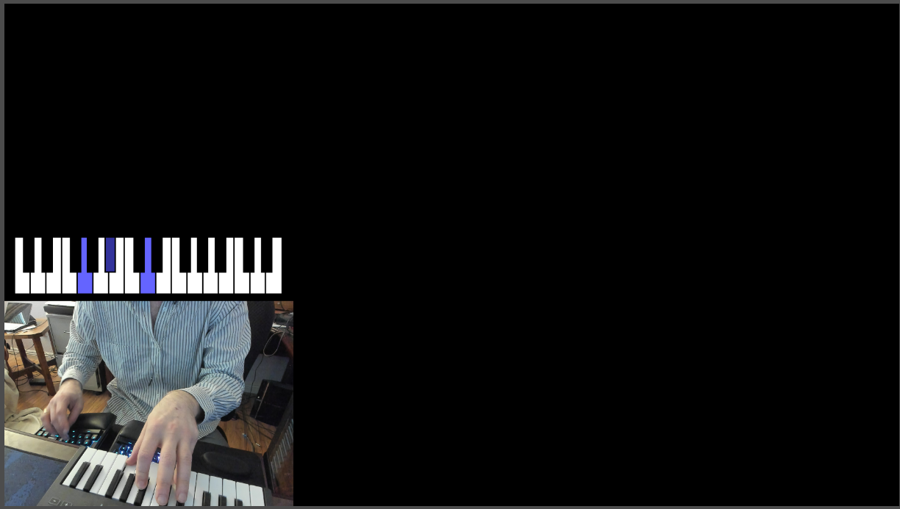
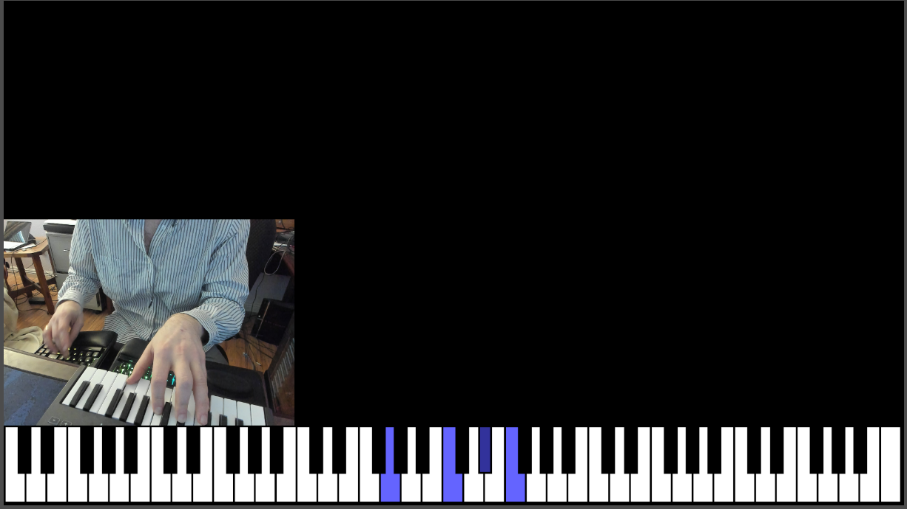

# TASagentStreamBot KeyboardDisplay

Demonstrations of my extensible, modular C# [stream bot development framework](https://github.com/TASagent/TASagentTwitchBotCore) with rebinding midi input to keyboard output, and a keyboard input display.

## How do I use this?

Simply launch the executable. You can download the build program from the Releases.

To build the project, get the appropriate [NetCore 6 SDK (With AspNet)](https://dotnet.microsoft.com/download/dotnet/6.0), navigate to the project directory `cd TASagentStreamBot.KeyboardDisplay/TASagentStreamBot.KeyboardDisplay`, and build the DotNet project: `dotnet publish -c Release -r win-x64`.

## BrowserSources

In OBS, you can optionally add the following BrowserSource(s):

`http://localhost:5000/BrowserSource/PianoDisplay.html` - Small Piano input display overlay

`http://localhost:5000/BrowserSource/FullPianoDisplay.html` - Full Piano input display overlay

